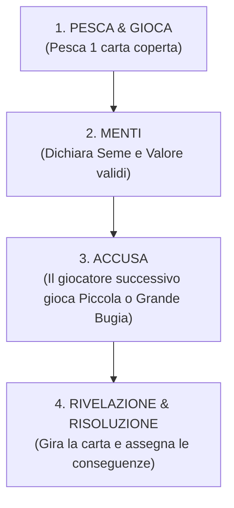

# Pinocchio: È solo una bugia
**Un gioco di bluff, deduzione e nasi lunghi**  
*Autore:* Federico Latini  

---

### 📋 Scheda del Gioco
* **Giocatori:** 2–6 giocatori
* **Età consigliata:** 10+
* **Durata:** ~20 minuti
* **Componenti:** 78 carte fisiche
* **Meccaniche principali:** Bluff, Deduzione a parametri, Spatial Indicator (Allungamento del Naso), Modificatori dei Personaggi

---

## 🎭 1. Introduzione & Scopo del Gioco

In questo gioco tutti i partecipanti vestono i panni del celebre burattino di legno: **Pinocchio**.  
Ad ogni turno, la fata turchina e la tua coscienza ti mettono alle strette: sarai costretto a **mentire**, scegliendo se pronunciare una **Piccola Bugia** (alterando un solo dettaglio tra seme e valore) o una **Grande Bugia** (stravolgendo ogni cosa).

L'obiettivo è farla franca ed evitare di essere scoperti dagli altri giocatori: ogni volta che un avversario intuisce esattamente che tipo di menzogna hai pronunciato, il tuo naso crescerà fisicamente sul tavolo, allontanando la punta dalla testa.

> 🏆 **Condizione di Vittoria:**  
> La partita termina nell'istante esatto in cui la Riserva Comune dei Nasi (18 carte) si esaurisce del tutto, oppure se un giocatore raggiunge la lunghezza massima del naso (4 segmenti). Il giocatore che possiede il **naso più corto** (minor numero di segmenti interrotti) è proclamato vincitore! In caso di parità, la vittoria è condivisa.

---

## 📦 2. Componenti di Gioco (78 Carte Complessive)

Ogni carta è composta da un **fronte** e dal rispettivo **dorso** coordinato:

### A. Mazzo Avventura (18 Carte)
Ciascuna carta presenta sul dorso la composizione simmetrica dei due Pinocchi e sul fronte la grafica tematica:
* **16 Carte Standard (Valori da 1 a 4 per 4 Semi Tematici):**
  1. 🪙 **Zecchino:** Il tesoro d'oro zecchino promesso dal Gatto e la Volpe (valori 1, 2, 3, 4).
  2. ☕ **Tazzina:** La tazza calda dell'Osteria del Gambero Rosso (valori 1, 2, 3, 4).
  3. 🪵 **Ciocco:** Il legno grezzo di Mastro Ciliegia da cui nacque il burattino (valori 1, 2, 3, 4).
  4. 🗡️ **Sciabola:** L'arma dei gendarmi e dei burattini di Mangiafuoco (valori 1, 2, 3, 4).

* **2 Carte Jolly Speciali:**
  * 🃏 **Jolly Seme:** Il seme dichiarato è sempre considerato vero; il valore è falso.
  * 🃏 **Jolly Numero:** Il valore dichiarato è sempre considerato vero; il seme è falso.

---

### 🔍 Anatomia della Carta Tipo

1. **Il Grande Medaglione Centrale (Il Valore):**  
   Al centro campeggia a caratteri cubitali il **Numero** (da 1 a 4, oppure `?` nei Jolly). Quando la carta viene calata e rivelata al centro del tavolo, il suo valore è immediatamente visibile per tutti da qualsiasi angolazione.
2. **I Quattro Medaglioni Angolari (Il Seme):**  
   Nei quattro angoli è impressa l'illustrazione del **Seme**. Questa disposizione a quattro punti permette di identificare il seme aprendo le carte a ventaglio da destra o da sinistra, o leggendole capovolte dal lato opposto del tavolo.
3. **Cornice d'Autore e Codice Colore dei Semi:**  
   * 🪙 **Zecchino:** *Oro Antico & Ambra* (`#A27745`)
   * 🪵 **Ciocco:** *Marrone Legno Vivo* (`#6D553F`)
   * ☕ **Tazzina:** *Blu Fiaba & Avorio* (`#83BCFF`)
   * 🗡️ **Sciabola:** *Giallo Pergamena Brillante* (`#FFFFA0`)
   * 🃏 **Jolly:** *Rosso Cremisi Mistero* (`#C0392B`)

---

### B. Carte Setup del Giocatore (36 Carte)
6 set completi per i giocatori (da 6 carte ciascuno):
* 👤 **6 Carte Testa di Pinocchio:** Fronte con illustrazione della testa (inizio dell'indicatore).
* 👃 **6 Carte Punta del Naso:** Fronte con illustrazione della punta (fine dell'indicatore).
* 📜 **6 Carte di Riepilogo:** Schema sintetico delle regole di dichiarazione e accusa.
* 🗣️ **6 Carte Dichiarazione:** La formula scenica per pronunciare la bugia di turno.
* 🤏 **6 Carte Piccola Bugia:** Carta accusa per contestare un solo parametro alterato.
* 🤥 **6 Carte Grande Bugia:** Carta accusa per contestare entrambi i parametri alterati.

---

### C. Carte Naso Intermedio (18 Carte)
* 📏 **18 Carte Naso Intermedio:** I segmenti di ramo ligneo fiorito con foglie. Costituiscono la **Riserva Comune dei Nasi** (fissa a 18 carte per qualsiasi numero di giocatori).

---

### D. Carte Personaggio dell'Avventura (6 Carte)
6 carte speciali che alterano le regole ordinarie del gioco:
1. ✍️ **Collodi** *(Effetto Permanente)*
2. 🧚 **Fatina** *(Effetto Istantaneo)*
3. ⚖️ **Giudice** *(Effetto Permanente)*
4. 🎭 **Mangiafuoco** *(Effetto Permanente)*
5. 🎪 **Lucignolo** *(Effetto Permanente)*
6. 🦗 **Grillo** *(Effetto Istantaneo)*

> 🔢 **Riepilogo Totale Componenti:**  
> **18** (Mazzo Avventura) + **36** (Setup Giocatori) + **18** (Nasi Intermedi) + **6** (Personaggi) = **78 Carte Fisiche Complessive**.

---

## 🛠️ 3. Preparazione della Partita (Setup)

1. **Dotazione dei Giocatori (6 Carte ciascuno):**  
   Ogni partecipante prende un set personale: 1 Testa, 1 Punta, 1 Riepilogo, 1 Dichiarazione, 1 Piccola Bugia, 1 Grande Bugia.
2. **Allestimento dell'Indicatore Iniziale:**  
   Ciascun giocatore allinea davanti a sé la propria **Testa** a contatto diretto con la **Punta del Naso**:  
   `[ TESTA ]` ➡️ `[ PUNTA ]` *(Naso a lunghezza zero, nessun segmento intermedio).*
3. **Riserva Comune dei Nasi (Sempre 18 Carte):**  
   Posiziona tutte le **18 Carte Naso Intermedio** al centro del tavolo a formare la riserva comune, a prescindere dal numero di giocatori (da 2 a 6).
4. **Mazzetto Personaggi dell'Avventura:**  
   Mescola le 6 carte Personaggio e disponile in un mazzetto **coperto** a faccia in giù accanto alla riserva dei nasi.
5. **Preparazione del Mazzo di Gioco:**  
   Mescola le 18 carte del Mazzo Avventura e posizionalo coperto al centro.
6. **Carta Base di Partenza:**  
   Rivela la prima carta del Mazzo Avventura e collocala scoperta a terra: è la **Carta Base di Partenza**. *(Se è un Jolly, rimescolalo nel mazzo ed estrai una carta standard).*
7. **Primo Giocatore:**  
   Il giocatore più vicino al proprio compleanno è il primo giocatore. Si gioca in senso orario.

---

## 🪵 4. L'Espansione Fisica del Naso

Quando vieni smascherato da un'accusa corretta, il tuo burattino cresce fisicamente sul tavolo: separa la Testa e la Punta e fai scivolare in mezzo le **Carte Naso Intermedio** guadagnate.

I rami dell'illustrazione sono calibrati in continuità orizzontale perfetta: più menti male, più il tavolo sarà occupato dal tuo naso fiorito!

---

## 🔄 5. Il Flusso del Turno

Il turno si articola in quattro fasi consecutive:

---

### Fase 1: Pesca & Gioca
Il giocatore di turno pesca la prima carta dal Mazzo Avventura e la pone **coperta** sul tavolo davanti a sé, senza mostrarla ad alcuno.

---

### Fase 2: Menti (La Dichiarazione)
Il giocatore annuncia ad alta voce un **Seme** e un **Valore** (da 1 a 4).  

> [!CAUTION]
> ### ⛔ Regola Fondamentale & Penalità di 3 Nasi
> **È severamente vietato dire la verità completa!**  
> Non puoi mai dichiarare esattamente il seme e il numero della carta che hai in mano (salvo per effetto speciale della carta *Grillo*).  
> Inoltre, la dichiarazione deve essere formalmente valida rispetto alla carta base scoperta a terra:
> * **Stesso Seme:** Deve essere obbligatoriamente di **VALORE PIÙ BASSO** rispetto alla carta a terra.
> * **Seme Differente:** Deve essere obbligatoriamente di **VALORE PIÙ ALTO** rispetto alla carta a terra.
> 
> 🚨 **PENALITÀ IMMEDIATA:** Se il giocatore dichiara per errore la **verità esatta** o compie una **dichiarazione incongrua/invalida** (es. stesso seme con valore più alto, oppure seme differente con valore più basso), subisce immediatamente una penalità di **3 CARTE NASO** dalla riserva comune!

* **Bluff del Jolly:** Non sei limitato ai numeri reali da 1 a 4. Puoi dichiarare valori impossibili (es. *Ciocco 7*) simulando di aver giocato un Jolly!

> 🎭 *Formula scenica:*  
> «Sulla mia testa di legno: giace qui un [Seme] di valore [Numero]!»

---

### Fase 3: L'Accusa
Il giocatore immediatamente alla tua sinistra (salvo modificatori dei Personaggi) è l'**Accusatore di turno**.  
L'accusatore sceglie e cala una delle sue due carte accusa:

* 🤏 **Piccola Bugia:** Sostiene che hai cambiato **un solo parametro** (hai mentito solo sul seme *oppure* solo sul numero).  
  *«Le tue bugie han le gambe corte!»*
* 🤥 **Grande Bugia:** Sostiene che hai cambiato **entrambi i parametri** (hai mentito sia sul seme *sia* sul numero).  
  *«Questa è bugia col naso lungo!»*

---

### Fase 4: Rivelazione & Risoluzione
Il giocatore di turno gira la carta coperta a faccia in su:

#### ❌ Se l'Accusatore SBAGLIA:
* Il bugiardo l'ha passata liscia! Nessuno subisce penalità e nessun naso cresce.

#### ✔️ Se l'Accusatore INDOVINA:
* Il giocatore di turno è stato scoperto e subisce l'allungamento del naso:
  * Se l'accusa corretta era **Piccola Bugia:** riceve **1 Carta Naso Intermedio**.
  * Se l'accusa corretta era **Grande Bugia:** riceve **2 Carte Naso Intermedio**.

---

## 🌟 6. I Personaggi dell'Avventura (Nuova Meccanica)

Durante la partita, il mondo di Collodi interviene a stravolgere le dinamiche al tavolo!

### ⚡ Come si Attivano i Personaggi
Il mazzetto Personaggi resta coperto al centro.  
**Appena una Grande Bugia viene indovinata** (l'accusatore smaschera con successo una Grande Bugia), si rivela immediatamente la prima carta del mazzetto Personaggi:
* Se la carta è un **Effetto Istantaneo**, si applica subito e si conclude.
* Se la carta è un **Effetto Permanente**, resta attiva al centro del tavolo e influenza tutti i turni successivi, finché non viene rimpiazzata dalla rivelazione del personaggio successivo.

---

### 📜 I 6 Personaggi e i loro Poteri

| Personaggio | Tipo Effetto | Regola Speciale |
| :--- | :---: | :--- |
| ✍️ **Collodi** | *Permanente* | Finché questo personaggio è in gioco, ogni giocatore **deve recitare la propria frase storica** (la citazione stampata sulla carta) prima di dichiarare numero e seme, e prima di accusare (*Grande* o *Piccola Bugia*). Chi dimentica di recitarla riceve 1 ammonizione formale! |
| 🧚 **Fatina** | *Istantaneo* | Appena entra in gioco, una provvidenziale magia soccorre chi è più in difficoltà: **tutti i giocatori che hanno il maggior numero di carte naso** (il/i leader col naso più lungo) **scartano 1 carta naso** e la rimettono nella riserva comune. |
| ⚖️ **Giudice** | *Permanente* | Finché questo personaggio è in gioco, non accusa un solo giocatore: **tutti i giocatori al tavolo (tranne il dichiarante) votano segretamente** calando coperta la propria carta *Piccola Bugia* o *Grande Bugia*. Si rivelano all'unisono: la maggioranza determina l'accusa ufficiale del tavolo. In caso di parità esatta, il voto del giocatore alla sinistra del dichiarante funge da spareggio. |
| 🎭 **Mangiafuoco** | *Permanente* | Finché questo personaggio è in gioco, il senso dell'accusa si inverte: **a giudicare la bugia è il giocatore alla DESTRA** del giocatore di turno (anziché alla sinistra). |
| 🎪 **Lucignolo** | *Permanente* | Nel Paese dei Balocchi vige l'anarchia: finché c'è Lucignolo in gioco, non c'è un giudice prestabilito. **Il primo giocatore al tavolo che vota/grida "Grande Bugia" o "Piccola Bugia"** (girando la carta a terra) diventa il giudice di quel turno! Se indovina, **scarta 2 carte naso** dal proprio indicatore; se sbaglia, **prende 1 carta naso** dalla riserva comune. |
| 🦗 **Grillo** | *Istantaneo* | La voce della coscienza si fa sentire: appena entra in gioco, il **prossimo giocatore di turno ha la facoltà speciale di poter DIRE LA VERITÀ** (dichiarare esattamente la carta che possiede). Il suo giudice di turno non sceglie tra Piccola e Grande Bugia, ma dichiara ad alta voce se il giocatore ha detto la **Verità** o una **Bugia**! |

---

## 🃏 7. Regole Speciali per i Jolly

Se la carta rivelata è un Jolly:
* **Jolly Seme:** Il seme dichiarato è sempre considerato *corretto*; il valore dichiarato è considerato *errato*.  
  👉 **Risolve SEMPRE come Piccola Bugia.**
* **Jolly Numero:** Il valore dichiarato è sempre considerato *corretto*; il seme dichiarato è considerato *errato*.  
  👉 **Risolve SEMPRE come Piccola Bugia.**

---

## 🔁 8. Nuovo Turno e Fine Partita

1. **Nuova Carta Base:**  
   La carta appena rivelata diventa la nuova Carta Base per il giocatore successivo.  
   *(Se la carta rivelata era un Jolly:* Raccogli tutte le carte giocate e il mazzo, rimescola l'intero Mazzo Avventura e scopri una nuova carta base standard).*
2. **Esaurimento Mazzo di Pesca:**  
   Se le carte del Mazzo Avventura terminano prima che la Riserva Nasi sia esaurita, rimescola tutte le carte giocate in precedenza (tranne l'attuale carta base) per ricreare la pila di pesca.
3. **Fine Partita:**  
   La partita termina **immediatamente** nell'istante esatto in cui:
   * La Riserva Comune dei Nasi (18 carte) si esaurisce del tutto; **OPPURE**
   * Un giocatore raggiunge la lunghezza critica di 4 segmenti naso.
   
   Ciascun giocatore conta i propri segmenti intermedi: **chi ha il minor numero di carte naso (il naso più corto) vince la partita!** In caso di parità, la vittoria è condivisa.

---

## ❓ 9. FAQ e Note di Gioco

**D: Cosa succede se per sbaglio dico la verità sulla carta che ho pescato?**  
R: Nel mondo di Pinocchio, la sincerità ordinaria è un errore fatale! Se un giocatore dichiara esattamente il seme e il numero della carta calata (senza che sia attivo l'effetto del *Grillo*), subisce immediatamente la penalità di **3 carte Naso** dalla riserva comune.

**D: Cosa succede se faccio una dichiarazione non valida (es. stesso seme con valore più alto, o seme differente con valore più basso)?**  
R: Anche una dichiarazione formalmente scorretta costituisce una violazione delle regole di gioco e viene punita all'istante con **3 carte Naso** dalla riserva comune.

**D: Con 18 carte naso fisse, cosa cambia se giochiamo in 2 o in 6?**  
R: La riserva comune è sempre di 18 carte. In 5 o 6 giocatori la riserva si contenderà più velocemente, rendendo le partite serrate ed emozionanti; in 2 o 3 giocatori il duello psicologico sarà più profondo e prolungato.

**D: Se c'è Lucignolo in gioco, posso astenermi dal contestare?**  
R: Sì! Se nessuno se la sente di rischiare, il giocatore di turno la passa liscia senza penalità per nessuno. Ma il primo che scatta può scartare ben 2 nasi se indovina!
