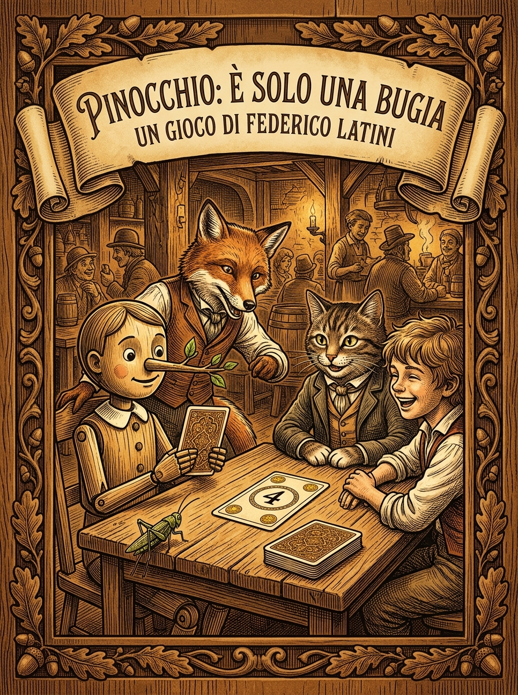

# Pinocchio: È solo una bugia
**Un gioco di bluff, deduzione e nasi lunghi ideato da Federico Latini**  
*Edizione Ufficiale per la Celebrazione del Bicentenario della nascita di Carlo Collodi (1826–2026)*

---

### 📋 Scheda del Gioco
* **Autore:** Federico Latini
* **Giocatori:** 2–5 giocatori (scalabile fino a 6)
* **Età consigliata:** 10+
* **Durata:** ~20 minuti
* **Occasione Speciale:** Bicentenario di Carlo Collodi (1826–2026)
* **Componenti:** 78 carte fisiche complessive con illustrazioni d'autore e 4 dorsi differenziati
* **Meccaniche principali:** Bluff, Deduzione a parametri, Spatial Indicator (Allungamento del Naso), Modificatori Dinamici dei Personaggi

---

## 🇮🇹 L'Omaggio al Bicentenario di Collodi (1826–2026)
Nel 2026 ricorre il **Bicentenario della nascita di Carlo Collodi** (Carlo Lorenzini, Firenze 1826).  
*Pinocchio: È solo una bugia* nasce come tributo ludico ed editoriale al capolavoro assoluto della letteratura italiana nel mondo: *Le avventure di Pinocchio. Storia di un burattino*.

Con uno stile grafico ispirato alle preziose incisioni e xilografie toscane ottocentesche su pergamena e legno, il gioco trasforma il tema della menzogna in una brillante sfida di astuzia psicologica, dove ogni giocatore sperimenta la tensione e il fascino di dover mentire a ogni turno per salvare il proprio naso.  
È il progetto perfetto per una **casa editrice che fa dell'Italianità, del patrimonio culturale e della cura estetica il proprio tratto distintivo**.

---

## 🎭 1. Introduzione & Scopo del Gioco

In questo gioco tutti i giocatori vestono i panni di **Pinocchio**: ad ogni turno si è costretti a **mentire**, scegliendo se pronunciare una **Piccola Bugia** (cambiando un solo parametro tra seme e valore) o una **Grande Bugia** (stravolgendo entrambi i parametri).

L'obiettivo è farla franca ed evitare di essere scoperti dagli avversari: al termine della partita, chi sarà riuscito a mantenere il **naso più corto** otterrà la vittoria!

> 🏆 **Condizione di Vittoria:**  
> La partita termina nell'istante esatto in cui il **Mazzo Nasi intermedi (18 carte)** al centro del tavolo si esaurisce del tutto. Ciascun partecipante conta i segmenti naso accumulati tra la propria Testa e Punta: il giocatore con il minor numero di carte Naso vince la partita. In caso di parità, la vittoria è condivisa.

---

## 📦 2. Componenti di Gioco (78 Carte Fisiche Complessive)

Tutte le carte del gioco vantano una veste grafica illustrata a tema e si dividono in categorie con **4 dorsi differenziati** per garantire una preparazione e un riordino immediati:

### A. Mazzo di Gioco (18 Carte)
*(Dorso classico con Pinocchi speculari e semi d'angolo)*
* **16 Carte Standard (Valori da 1 a 4 per 4 Semi Tradizionali):**
  * 🪙 **Zecchino:** Il tesoro sepolto nel Campo dei Miracoli (valori 1, 2, 3, 4).
  * ☕ **Tazzina:** La bevanda calda all'Osteria del Gambero Rosso (valori 1, 2, 3, 4).
  * 🪵 **Ciocco:** Il legno parlante di Mastro Ciliegia e Geppetto (valori 1, 2, 3, 4).
  * 🗡️ **Sciabola:** La lama dei gendarmi e della compagnia dei burattini (valori 1, 2, 3, 4).
* **2 Carte Jolly Speciali (con Illustrazioni Dedicate):**
  * 🃏 **Jolly Seme:** Il giullare burattino che volteggia con i 4 semi. *Il seme dichiarato è sempre considerato corretto; il valore dichiarato è errato. Risolve sempre come Piccola Bugia.*
  * 🃏 **Jolly Numero:** Il giullare burattino che giostra i numeri 1-4. *Il valore dichiarato è sempre considerato corretto; il seme dichiarato è errato. Risolve sempre come Piccola Bugia.*

---

### B. Carte Setup del Giocatore (36 Carte)
*(Dotazione completa per 6 giocatori, ciascuno con 6 carte illustrate dedicate)*
* 👤 **6 Carte Testa di Pinocchio:** Fronte illustrato con la testa del burattino (inizio dell'indicatore).
* 👃 **6 Carte Punta del Naso:** Fronte illustrato con la punta del naso (termine dell'indicatore).
* 🗣️ **6 Carte Dichiarazione:** Con incisione di Pinocchio oratore che declama e le istruzioni del turno.
* 🤏 **6 Carte Piccola Bugia:** Con incisione di Pinocchio sornione e il primo bocciolo sul naso.
* 🤥 **6 Carte Grande Bugia:** Con incisione drammatica di Pinocchio con il naso ad albero frondoso.
* 📜 **6 Carte Riepilogo di Gioco:** Con l'antico tomo delle cronache, calamaio e marionetta.

---

### C. Mazzo Nasi Intermedi (18 Carte)
*(Dorso esclusivo verticale con ramo fiorito)*
* 📏 **18 Carte Naso Intermedio:** Segmenti di legno vivo fogliato che allungano fisicamente il naso del giocatore quando viene sorpreso a mentire. Costituiscono la riserva comune fissa.

---

### D. Carte Personaggio dell'Avventura (6 Carte)
*(Dorso dedicato con Maschere teatrali, Calamaio, Penna d'oca e Burattini)*
I 6 indimenticabili comprimari del romanzo di Collodi, ciascuno con ritratto d'autore xilografico:
1. ✍️ **Collodi** *(Permanente)*
2. 🧚 **Fatina** *(Istantaneo)*
3. ⚖️ **Giudice** *(Permanente)*
4. 🎭 **Mangiafuoco** *(Permanente)*
5. 🎪 **Lucignolo** *(Permanente)*
6. 🦗 **Grillo** *(Istantaneo)*

---

## 🛠️ 3. Preparazione della Partita (Setup per 2–6 Giocatori)

1. **Dotazione Individuale:**  
   Ogni partecipante riceve un set di 6 carte:
   * 1 Carta Testa
   * 1 Carta Punta
   * 1 Carta Dichiarazione
   * 1 Carta Piccola Bugia
   * 1 Carta Grande Bugia
   * 1 Carta Riepilogo di Gioco
2. **Composizione dell'Indicatore del Naso:**  
   Ciascun giocatore compone il proprio indicatore personale disponendo sul tavolo, da sinistra a destra: **Testa** a sinistra, **Punta** a destra, unite e a contatto diretto (lunghezza naso iniziale pari a zero).
3. **Riserva Comune dei Nasi:**  
   Le **18 Carte Naso Intermedio** formano il *Mazzo Naso comune* a faccia in giù al centro del tavolo.
4. **Mazzo di Gioco e Carta Base di Partenza:**  
   Mescolare le **18 carte del Mazzo di Gioco**.  
   Rivelare la prima carta del mazzo e posizionarla scoperta al centro: è la **carta base di riferimento iniziale**.  
   *(Se si tratta di un Jolly, rimescolarlo nel mazzo ed estrarre una carta standard).*
5. **Mazzetto Personaggi:**  
   Mescolare le 6 carte Personaggio e collocarle coperte al centro del tavolo.
6. **Primo Giocatore:**  
   Il partecipante il cui compleanno è più vicino alla data odierna è il primo giocatore. Il gioco prosegue in senso orario.

---

## 🔄 4. Il Turno di Gioco

Il turno si suddivide in **4 fasi sequenziali**:

### 1. Pesca e Gioca
Peschi 1 carta coperta dal Mazzo di Gioco e la cali coperta sul tavolo davanti a te, senza mostrarla ad alcuno.

### 2. Menti (La Dichiarazione)
Dichiari ad alta voce un **Seme** e un **Valore**.  
Rispetto alla carta di riferimento attualmente scoperta al centro del tavolo, la tua dichiarazione **deve possedere una delle seguenti caratteristiche, ma non entrambe**:
* **Stesso Seme** della carta di riferimento (ma con valore diverso)
* **Stesso Numero** della carta di riferimento (ma con seme diverso)

> 💡 **La Regola d'Oro del Bluff:**  
> Non sei limitato a dichiarare i semi e i numeri realmente esistenti nel mazzo (ad esempio puoi dichiarare valore 5, 8, o semi fittizi): puoi sempre far credere agli avversari di avere in mano un **Jolly**!

---

### 3. Accusa
Il giocatore alla tua sinistra (il giocatore dopo di te in senso orario, salvo modificatori dei Personaggi) veste i panni del Giudice / Accusatore. Deve intuire la natura della tua menzogna e può dichiarare:
* 🤏 **Piccola Bugia:**  
  *«Hai cambiato solo una cosa della carta che hai in mano!»* (Sostieni che ha alterato o solo il seme, o solo il numero).
* 🤥 **Grande Bugia:**  
  *«Hai cambiato tutto della carta che hai in mano!»* (Sostieni che ha alterato sia il seme sia il numero).

---

### 4. Rivelazione & Conseguenze
Gira e rivela a tutti la carta che avevi calato:

* ❌ **Se l'accusatore SBAGLIA:**  
  Non succede nulla! L'hai passata liscia, il tuo bluff ha trionfato e non ricevi alcun segmento naso.
* ✅ **Se l'accusatore INDOVINA:**  
  Il giocatore di turno viene punito per essere stato scoperto:
  * In caso di **Piccola Bugia indovinata**: il giocatore di turno prende **1 carta Naso** dal Mazzo comune e la inserisce tra la sua Testa e la sua Punta.
  * In caso di **Grande Bugia indovinata**: il giocatore di turno prende **2 carte Naso** dal Mazzo comune e le inserisce nel proprio indicatore. Inoltre, **si scopre immediatamente una carta dal Mazzetto Personaggi**!

---

### 5. Nuovo Turno
* La carta appena rivelata diventa la **nuova carta di riferimento** per il turno del giocatore successivo.
* *(Se la carta rivelata è un Jolly, si rimescola l'intero Mazzo di Gioco e si scopre una nuova carta base standard dal mazzo).*
* Si verifica se il Mazzo Naso comune si è esaurito; in caso contrario, il turno passa al giocatore successivo in senso orario.

---

## 🃏 5. Regole Speciali per i Jolly

I due Jolly introducono un livello supremo di deduzione e depistaggio:

| Carta Jolly | Seme Considerato | Valore Considerato | Risoluzione Accusa |
| :--- | :--- | :--- | :--- |
| **Jolly Seme** | ✅ Sempre CORRETTO | ❌ Sempre ERRATO | Risolve **sempre** come **Piccola Bugia** |
| **Jolly Numero** | ❌ Sempre ERRATO | ✅ Sempre CORRETTO | Risolve **sempre** come **Piccola Bugia** |

Quando un Jolly viene rivelato, a prescindere dal seme o valore che il giocatore aveva annunciato, la verifica dell'accusa si calcola applicando le regole sopra.  
Al termine della risoluzione, il Jolly non resta come carta base: l'intero mazzo di gioco viene rimescolato e si gira una nuova carta standard di riferimento.

---

## 🌟 6. I Personaggi dell'Avventura

Nel corso della partita, le figure chiave dell'opera di Collodi fanno il loro ingresso al tavolo, ribaltando le abitudini e le certezze dei giocatori.

### Come si Attivano i Personaggi
Il Mazzetto Personaggi resta coperto al centro della plancia.  
Ogni volta che l'accusatore **INDOVINA una Grande Bugia**, si scopre la prima carta in cima al mazzetto:
* **Effetto Istantaneo:** Si applica immediatamente nell'istante in cui appare, dopodiché la carta viene rimossa o scartata.
* **Effetto Permanente:** Rimane scoperta al centro del tavolo e condiziona le giocate di tutti i partecipanti finché una nuova carta permanente non ne prende il posto.

| Personaggio | Tipo Effetto | Regola Speciale Ufficiale |
| :--- | :--- | :--- |
| ✍️ **Collodi** | *Permanente* | Ogni partecipante deve pronunciare la celebre frase iconica (*«C'era una volta... un pezzo di legno!»*) prima di annunciare valore e seme o avanzare un'accusa. Dimenticarsene costa 1 richiamo formale. |
| 🧚 **Fatina** | *Istantaneo* | Un prodigio va in aiuto di chi versa in cattive acque: i giocatori con più elementi naso nel proprio indicatore ne restituiscono 1 al Mazzo Naso comune. |
| ⚖️ **Giudice** | *Permanente* | L'accusa spetta alla collettività: tutti gli avversari votano segretamente giocando coperta una carta bugia. La maggioranza dei voti stabilisce l'accusa del turno (in caso di parità decide chi siede alla sinistra del giocatore di turno). |
| 🎭 **Mangiafuoco** | *Permanente* | L'ordine d'accusa si inverte: spetta al giocatore situato a **DESTRA** formulare l'accusa per il turno corrente anziché a sinistra. |
| 🎪 **Lucignolo** | *Permanente* | Il primo giocatore che esclama e gioca la propria carta bugia diventa l'accusatore di turno. Se **INDOVINA** elimina 2 carte naso dal proprio indicatore; se **SBAGLIA** ne riceve 1 dalla riserva comune! |
| 🦗 **Grillo** | *Istantaneo* | Chi gioca nel turno seguente ha la facoltà di **DIRE LA VERITÀ**. L'avversario di quel turno non accusa il tipo di bugia, ma valuta se è **Verità o Bugia**! |

---

## 🏁 7. Fine Partita e Condizione di Vittoria

La partita termina nell'istante esatto in cui il **Mazzo Nasi intermedi (18 carte)** si esaurisce del tutto.  
Ciascun giocatore conta i segmenti di legno compresi tra la propria Testa e Punta:
* Il giocatore che possiede il **minor numero di carte Naso** è proclamato vincitore!
* In caso di parità, la vittoria è condivisa tra i giocatori a pari merito col naso più corto.

---

## ❓ FAQ & Chiarimenti Rapidi

* **D: Posso dichiarare un valore 5 se le carte arrivano a 4?**  
  *R:* Certamente! Puoi dichiarare qualsiasi valore o seme compatibile con il vincolo (stesso seme o stesso valore della base), fingendo di avere un Jolly. L'avversario dovrà decidere se credere che tu abbia cambiato solo una cosa o entrambe.

* **D: Se l'accusatore sbaglia accusa, prende lui una carta naso?**  
  *R:* No, nelle regole ufficiali standard se l'accusatore sbaglia non accade nulla: il giocatore di turno l'ha semplicemente passata liscia. L'unica eccezione si verifica con **Lucignolo** in gioco (dove chi sbaglia l'accusa prende 1 naso).

* **D: Con Lucignolo, cosa succede se nessuno vuole accusare?**  
  *R:* L'accusa con Lucignolo è opzionale e aperta: se nessun avversario scatta ad accusare entro pochi secondi, il giocatore la passa liscia e il gioco prosegue normalmente.

---

*Regolamento Ufficiale ideato da **Federico Latini** per il Bicentenario della nascita di Carlo Collodi (1826–2026).*
